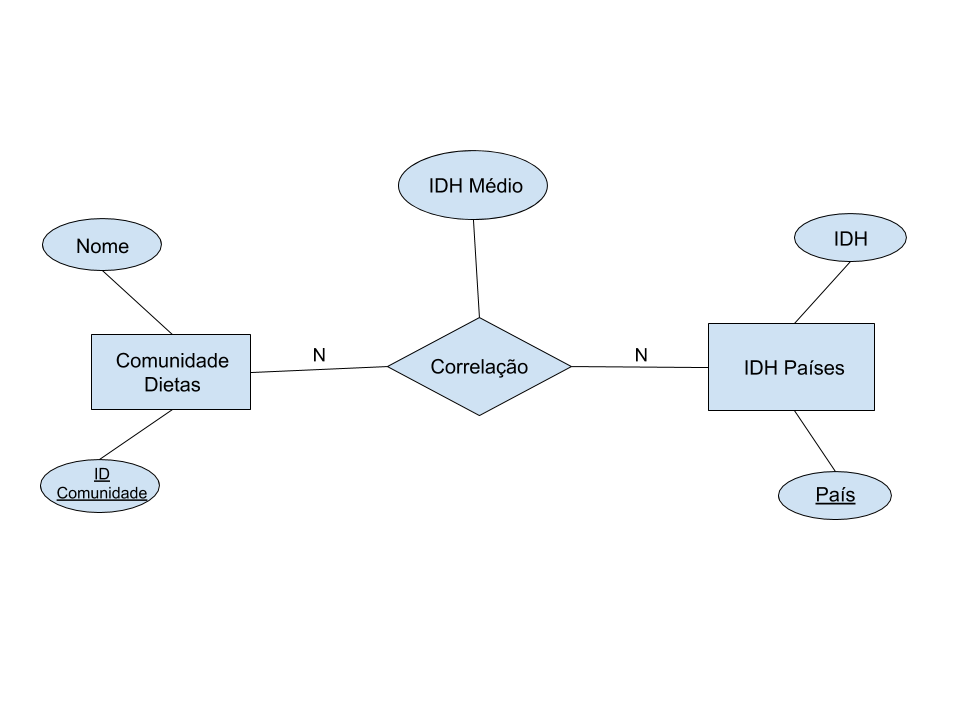

# Etapa 04 - Análises com o Segundo Modelo Lógico

## Slides da Apresentação da Etapa

> [Link para a Apresentação Final (pdf)](https://github.com/IucasF/Centro-de-Pesquisas-Asdrubal/blob/main/stage04/slides/Apresenta%C3%A7%C3%A3o%20Final%20MC536.pdf)  
> [Link para a Apresentação Final (pptx)](https://github.com/IucasF/Centro-de-Pesquisas-Asdrubal/blob/main/stage04/slides/Apresenta%C3%A7%C3%A3o%20Final%20MC536.pptx)

## Modelo Conceitual Atualizado

> 
> 
> 

## Modelos Lógicos Atualizados

~~~
ESQUIZOFRENIA(_Entidade_, Código, _Ano_, População, Continente, PorcentagemEsquizofreniaHomens, PorcentagemEsquizofreniaMulheres)
ANSIEDADE(_Entidade_, Código, _Ano_, PrevalênciaDistúrbiosMentais)
DEPRESSÃO(_Entidade_, Código, _Ano_, População, Continente, PrevalênciaDistúrbiosDepressívosHomens. PrevalênciaDistúrbiosDepressívosMulheres)
INSTALAÇÕES(_País_, _Ano_, HospitaisPsiquiátricos, UnidadesSaúdeMental, AmbulatórioSaúdeMental, TratamentoDiárioSaúdeMental, InstalaçõesResidenciaisComunitárias)
SOBREPESO/DESNUTRIÇÃO(Categoria, _Indicador_, CódigoIndicador, _País_, CódigoPaís, _Ano_, Valor, LinkMetadados, Comentários)
DIETA-SIMPLES(_País_, Cálcio, Colesterol, Fibra, Fruta, Legumes, Leite, CarneVermelha, Vegetais, Grãos)
DIETA-CÁLCIO(_FatorDieta_, Unidade, _País_, MédiaExposição, MédiaPontuação)
DIETA-COLESTEROL(_FatorDieta_, Unidade, _País_, MédiaExposição, MédiaPontuação)
DIETA-FIBRA(_FatorDieta_, Unidade, _País_, MédiaExposição, MédiaPontuação)
DIETA-FRUTAS(_FatorDieta_, Unidade, _País_, MédiaExposição, MédiaPontuação)
DIETA-GRÃOS(_FatorDieta_, Unidade, _País_, MédiaExposição, MédiaPontuação)
DIETA-LEITE(_FatorDieta_, Unidade, _País_, MédiaExposição, MédiaPontuação)
DIETA-CARNE-VERMELHA(_FatorDieta_, Unidade, _País_, MédiaExposição, MédiaPontuação)
DIETA-VEGETAIS(_FatorDieta_, Unidade, _País_, MédiaExposição, MédiaPontuação)
COMUNIDADES-DIETA(Nome, _IDComunidade_)
SEMELHANÇAS-DIETA(_Origem_, _Alvo_)
IDH(_País_, IDH)
~~~

## Programa de extração e conversão de dados atualizado

> Os arquivos notebooks já contêm ambos a extração de dados dos banco de dados presentes na lista de Arquivos de Dados no final desta página quanto as queries que manipularam e fizeram análises com tais dados.
> Segue abaixo os arquivos notebooks que fizeram extração/relacionamento de dados através do Kernel SQL no Jupyter:  
> [Primeiras Análises (Disorders and Weight Problems)](https://github.com/IucasF/Centro-de-Pesquisas-Asdrubal/blob/main/stage04/notebooks/ConnectingDatabasesv3.ipynb)  
> [Outras Análises (Disorders and Facilities)](https://github.com/IucasF/Centro-de-Pesquisas-Asdrubal/blob/main/stage04/notebooks/DisordersAndFacilities.ipynb)  
> [Outras análises (Community and IDH)](https://github.com/IucasF/Centro-de-Pesquisas-Asdrubal/blob/main/stage04/notebooks/ComunityAndIDH.ipynb) 

## Conjunto de queries de dois modelos

> Queries referentes à análise feita no Cypher:
~~~
LOAD CSV WITH HEADERS FROM 'https://raw.githubusercontent.com/IucasF/Centro-de-Pesquisas-Asdrubal/main/stage04/data/raw/.csv' AS line
CREATE (:Pais {nome: line. Country, calcio: line.calcio, colesterol: line.colesterol, fibra: line.fibra, fruta: line.fruta, legumes: line.legumes, leite: line.leite, carneVermelha: line.carneVermelha, vegetais: line.vegetais, graos: line.graos})

CREATE INDEX ON :Pais(nome)

MATCH (p1:Pais)
MATCH (p2:Pais)
WHERE toFloat(p1.calcio) - toFloat(p2.calcio) < 0.5 AND p1.nome <> p2.nome
MERGE (p1)-[p:parece]->(p2)
ON CREATE SET p.weight=1
ON MATCH SET p.weight=p.weight+1

MATCH (p1:Pais)
MATCH (p2:Pais)
WHERE toFloat(p1.colesterol) - toFloat(p2.colesterol) < 0.5 AND p1.nome <> p2.nome
MERGE (p1)-[p:parece]->(p2)
ON CREATE SET p.weight=1
ON MATCH SET p.weight=p.weight+1

MATCH (p1:Pais)
MATCH (p2:Pais)
WHERE toFloat(p1.fibra) - toFloat(p2.fibra) < 0.5 AND p1.nome <> p2.nome
MERGE (p1)-[p:parece]->(p2)
ON CREATE SET p.weight=1
ON MATCH SET p.weight=p.weight+1

MATCH (p1:Pais)
MATCH (p2:Pais)
WHERE toFloat(p1.fruta) - toFloat(p2.fruta) < 0.5 AND p1.nome <> p2.nome
MERGE (p1)-[p:parece]->(p2)
ON CREATE SET p.weight=1
ON MATCH SET p.weight=p.weight+1

MATCH (p1:Pais)
MATCH (p2:Pais)
WHERE toFloat(p1.legumes) - toFloat(p2.legumes) < 0.5 AND p1.nome <> p2.nome
MERGE (p1)-[p:parece]->(p2)
ON CREATE SET p.weight=1
ON MATCH SET p.weight=p.weight+1

MATCH (p1:Pais)
MATCH (p2:Pais)
WHERE toFloat(p1.leite) - toFloat(p2.leite) < 0.5 AND p1.nome <> p2.nome
MERGE (p1)-[p:parece]->(p2)
ON CREATE SET p.weight=1
ON MATCH SET p.weight=p.weight+1

MATCH (p1:Pais)
MATCH (p2:Pais)
WHERE toFloat(p1.carneVermelha) - toFloat(p2.carneVermelha) < 0.5 AND p1.nome <> p2.nome
MERGE (p1)-[p:parece]->(p2)
ON CREATE SET p.weight=1
ON MATCH SET p.weight=p.weight+1

MATCH (p1:Pais)
MATCH (p2:Pais)
WHERE toFloat(p1.vegetais) - toFloat(p2.vegetais) < 0.5 AND p1.nome <> p2.nome
MERGE (p1)-[p:parece]->(p2)
ON CREATE SET p.weight=1
ON MATCH SET p.weight=p.weight+1

MATCH (p1:Pais)
MATCH (p2:Pais)
WHERE toFloat(p1.graos) - toFloat(p2.graos) < 0.5 AND p1.nome <> p2.nome
MERGE (p1)-[p:parece]->(p2)
ON CREATE SET p.weight=1
ON MATCH SET p.weight=p.weight+1

match (p1)-[l:parece]->(p2)
where l.weight > 6
create (p1)-[:semelhante]->(p2)

match (p1)-[l:parece]->(p2)
delete l

CALL gds.graph.create(
  'prGraph',
  'Pais',
  'semelhante'
)

CALL gds.pageRank.stream('prGraph')
YIELD nodeId, score
RETURN gds.util.asNode(nodeId).nome AS name, score
ORDER BY score DESC, name ASC

CALL gds.graph.create(
  'relacaoDieta',
  'Pais',
  {
    semelhante: {
      orientation: 'UNDIRECTED'
    }
  }
)

CALL gds.louvain.stream('relacaoDieta')
YIELD nodeId, communityId
RETURN gds.util.asNode(nodeId).nome AS name, communityId
ORDER BY communityId ASC

CALL gds.louvain.stream('relacaoDieta')
YIELD nodeId, communityId
MATCH (p:Pais {name: gds.util.asNode(nodeId).nome})
SET p.community = communityId

match (source)-[semelhante]->(target)
WHERE source.nome <> target.nome
return source.nome,target.nome
~~~

## Bases de Dados

título da base | link | breve descrição
----- | ----- | -----
Instalações | https://apps.who.int/gho/data/node.main.MHFAC | Instalações para tratamento de problemas mentais por país (JSON) 
Transtornos | https://ourworldindata.org/mental-health | Transtornos mentais por país (CSV)
Suicídio/Felicidade | https://www.kaggle.com/rblcoder/mental-health-happiness-economics-human-freedom/notebook | Dados sobre Suicídio e níveis de felicidade por país (CSV)
Peso | https://data.unicef.org/dv_index/ | Taxa de obesidade, desnutrição entre outros por país (CSV)
Peso2 | https://www.who.int/data/nutrition/nlis/data-search | Taxa de obesidade e desnutrição por país (CSV)
Dieta | https://www.globaldietarydatabase.org/gdd-2015-beta-version | Informações sobre o tipo de dieta mais comum por país
Saúde_Geral | https://data.oecd.org/searchresults/?q=mental+health | Dados diversos relacionados à saúde, além de dados sobre índices de suicídio e de obesidade (CSV)
Países | https://data.world/badosa/uneces-country-overview | Dados geográficos gerais de países (JSON)
IDH | http://hdr.undp.org/en/composite/HDI | Valores do IDH de cada país
Geral | https://wiki.dbpedia.org/ | Dados gerais de países (grafo)

## Arquivos de Dados

Título da Base | Arquivo
----- | -----
Transtornos(1) | [Esquizofrenia](https://raw.githubusercontent.com/IucasF/Centro-de-Pesquisas-Asdrubal/main/stage04/data/external/databasse5_prevalence-of-schizophrenia-in-males-vs-femalesv3.csv)
Transtornos(2) | [Ansiedade](https://raw.githubusercontent.com/IucasF/Centro-de-Pesquisas-Asdrubal/main/stage04/data/external/anxiety_disorders_mh.csv)
Transtornos(3) | [Depressão](https://raw.githubusercontent.com/IucasF/Centro-de-Pesquisas-Asdrubal/main/stage04/data/external/depression_mh.csv)
Instalações | [Instalações](https://raw.githubusercontent.com/IucasF/Centro-de-Pesquisas-Asdrubal/main/stage04/data/external/mental_health_facilities_gho.csv)
Peso 2 | [Sobrepeso/Subnutrição](https://raw.githubusercontent.com/IucasF/Centro-de-Pesquisas-Asdrubal/main/stage04/data/external/database2_overweight_underweight.csv)
Dieta | [Dieta Simplificada](https://raw.githubusercontent.com/IucasF/Centro-de-Pesquisas-Asdrubal/main/stage04/data/external/dieta.csv)
Dieta(1) | [Dieta calcio](https://raw.githubusercontent.com/IucasF/Centro-de-Pesquisas-Asdrubal/main/stage04/data/raw/dietary%20calcium.tsv)
Dieta(2) | [Dieta colesterol](https://raw.githubusercontent.com/IucasF/Centro-de-Pesquisas-Asdrubal/main/stage04/data/raw/dietary%20cholesterol.csv)
Dieta(3) | [Dieta fibra](https://raw.githubusercontent.com/IucasF/Centro-de-Pesquisas-Asdrubal/main/stage04/data/raw/dietary%20fiber.csv)
Dieta(4) | [Dieta frutas](https://raw.githubusercontent.com/IucasF/Centro-de-Pesquisas-Asdrubal/main/stage04/data/raw/dietary%20fruit.csv)
Dieta(5) | [Dieta grãos](https://raw.githubusercontent.com/IucasF/Centro-de-Pesquisas-Asdrubal/main/stage04/data/raw/dietary%20grains.csv)
Dieta(6) | [Dieta leite](https://raw.githubusercontent.com/IucasF/Centro-de-Pesquisas-Asdrubal/main/stage04/data/raw/dietary%20milk.csv)
Dieta(7) | [Dieta carne vermelha](https://raw.githubusercontent.com/IucasF/Centro-de-Pesquisas-Asdrubal/main/stage04/data/raw/dietary%20red%20meat.csv)
Dieta(8) | [Dieta vegetais](https://raw.githubusercontent.com/IucasF/Centro-de-Pesquisas-Asdrubal/main/stage04/data/raw/dietary%20vegetables.csv)
Comunidades Dieta | [Países e suas comunidades de dieta](https://raw.githubusercontent.com/IucasF/Centro-de-Pesquisas-Asdrubal/main/stage04/data/processed/community.csv)
Source - Target | [Países com semelhanças nas dietas](https://raw.githubusercontent.com/IucasF/Centro-de-Pesquisas-Asdrubal/main/stage04/data/interim/source-target.csv)
IDH | [IDH Países](https://raw.githubusercontent.com/IucasF/Centro-de-Pesquisas-Asdrubal/main/stage04/data/external/paises_idh.csv)
